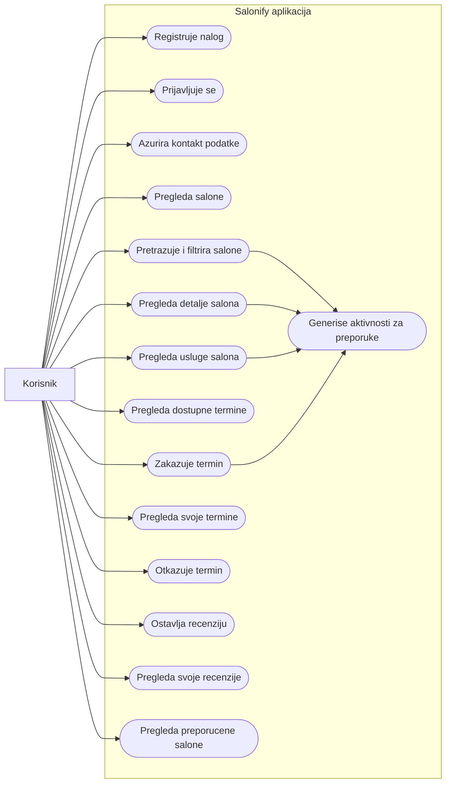
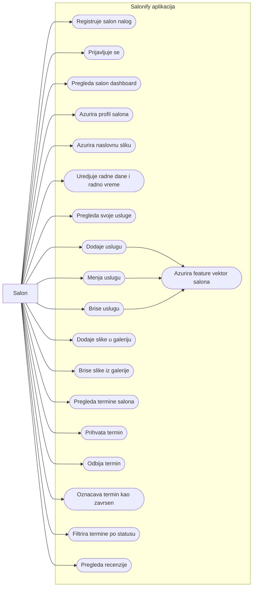
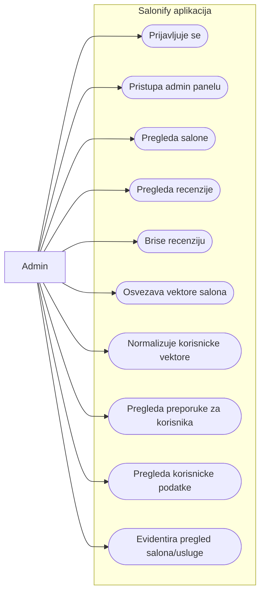
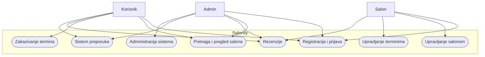
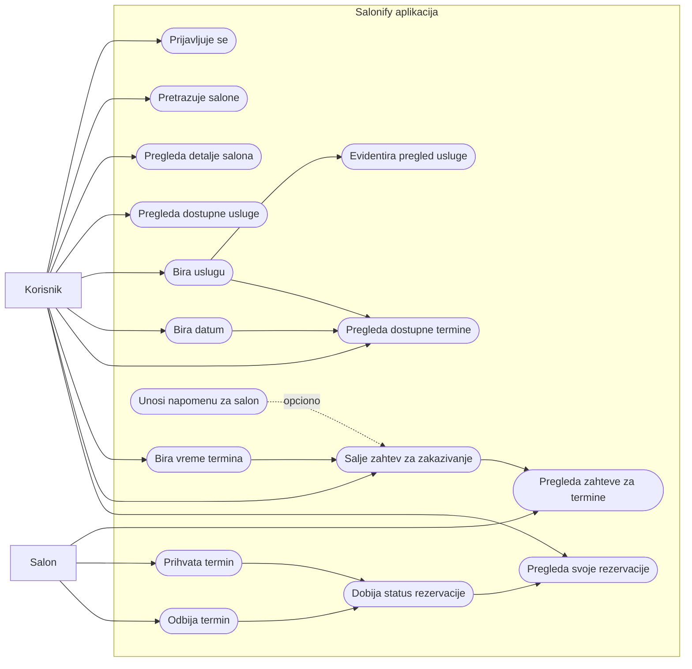

# Salonify - Use-case dijagrami po ulozi

Ovi dijagrami prikazuju glavne funkcionalnosti aplikacije po ulozi. Use-case-ovi su izvuceni iz backend kontrolera i frontend ruta: `User`, `Salon` i `Admin`.

## Korisnik

Korisnik koristi javni deo aplikacije za pronalazenje salona, zakazivanje i recenzije. Njegove aktivnosti kao sto su pretraga, pregled salona, pregled usluge i rezervacija ulaze u `PreferenceVector`, koji se kasnije koristi za content-based preporuke.

## Salon

Salon upravlja svojim profilom, uslugama, radnim vremenom, galerijom i terminima. Kada salon doda, izmeni ili obrise uslugu, sistem ponovo racuna `FeatureVector` salona, jer se time menja sadrzaj na osnovu kog se salon poredi sa korisnickim preferencijama.

## Admin

Admin ima poseban `/admin` panel. Trenutno su najvaznije admin funkcionalnosti odrzavanje sistema preporuka i moderacija recenzija: osvezavanje `FeatureVector` vrednosti za salone, normalizacija `PreferenceVector` vrednosti za korisnike i brisanje recenzija.

## Zajednicki pregled sistema

## Proces zakazivanja termina

Ovaj dijagram prikazuje use-case tok zakazivanja termina u aplikaciji Salonify. Primarni akter je korisnik, koji pronalazi salon, bira uslugu i salje zahtev za termin. Salon je sekundarni akter koji kasnije prihvata ili odbija zahtev.

Proces pocinje prijavom korisnika, jer je zakazivanje termina omoguceno samo korisnickim nalozima. Nakon toga korisnik pretrazuje salone, otvara detalje izabranog salona, pregleda dostupne usluge i bira uslugu koju zeli da zakaze. Sistem zatim prikazuje dostupne termine za izabrani datum i uslugu. Kada korisnik izabere vreme i posalje zahtev, termin dobija status `Pending`. Salon u svom dashboard-u pregleda zahtev i moze da ga prihvati ili odbije, nakon cega korisnik vidi azuriran status rezervacije.
